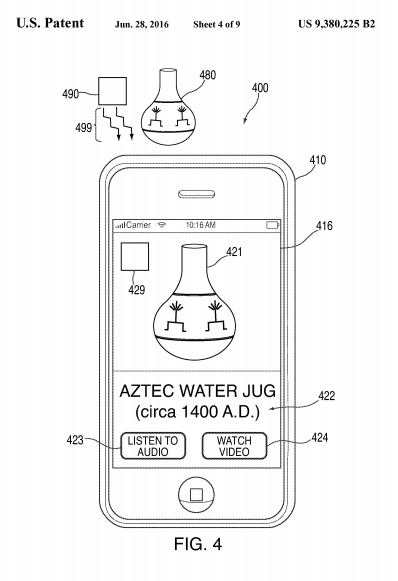

Apple Inc. registró en pasados días [una patente](http://patft.uspto.gov/netacgi/nph-Parser?Sect1=PTO2&Sect2=HITOFF&p=1&u=%2Fnetahtml%2FPTO%2Fsearch-bool.html&r=1&f=G&l=50&co1=AND&d=PTXT&s1=9,380,225&OS=9,380,225&RS=9,380,225) que propone el desarrollo de tecnología que restrinja las funciones de cámaras en Iphones por medio de señales de infrarojos. El objetivo es que dispositivos estratégicamente colocados transmitan una señal que prevenga la toma de videos o fotografías en direcciones específicas, por ejemplo un escenario, no así en otros sitios, por lo que no restringiría la toma de fotos en cualquier otra dirección.

Si bien la tecnología de infrarojos parecía estar en un declive, esta patente propuesta podría ponerla de nuevo en un lugar privilegiado, ya que este recurso podría ser utilizado en otros contextos como teatros o conciertos. Desde luego que los principales afectados son los usuarios que busquen grabar o tomar fotografías como recuerdos de un evento.

Asimismo podría tener otros resultados, por ejemplo la transmisión de información en determinados lugares, por ejemplos museos, ejemplo que ellos mismos exponen, donde la transmisión de información vía rayos infrarojos puede aportar valores informativos de determinada pieza al activar la cámara.

Es importante remarcar que este es el registro de una patente y que su desarrollo o implementación es aún una incógnita.

## 

[Apple has created a way to restrict your iPhone from taking pictures at concerts](http://www.techinsider.io/apple-patent-disables-camera-at-concerts-2016-6) / \[Antonio Villas-Boas - TechInsider\] Imagen: [Apple/USPTO](http://pdfpiw.uspto.gov/.piw?docid=09380225&PageNum=6&IDKey=CD402A66D44F&HomeUrl=http://patft.uspto.gov/netacgi/nph-Parser?Sect1=PTO2%2526Sect2=HITOFF%2526p=1%2526u=%25252Fnetahtml%25252FPTO%25252Fsearch-bool.html%2526r=1%2526f=G%2526l=50%2526co1=AND%2526d=PTXT%2526s1=9,380,225%2526OS=9,380,225%2526RS=9,380,225)
