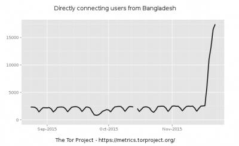
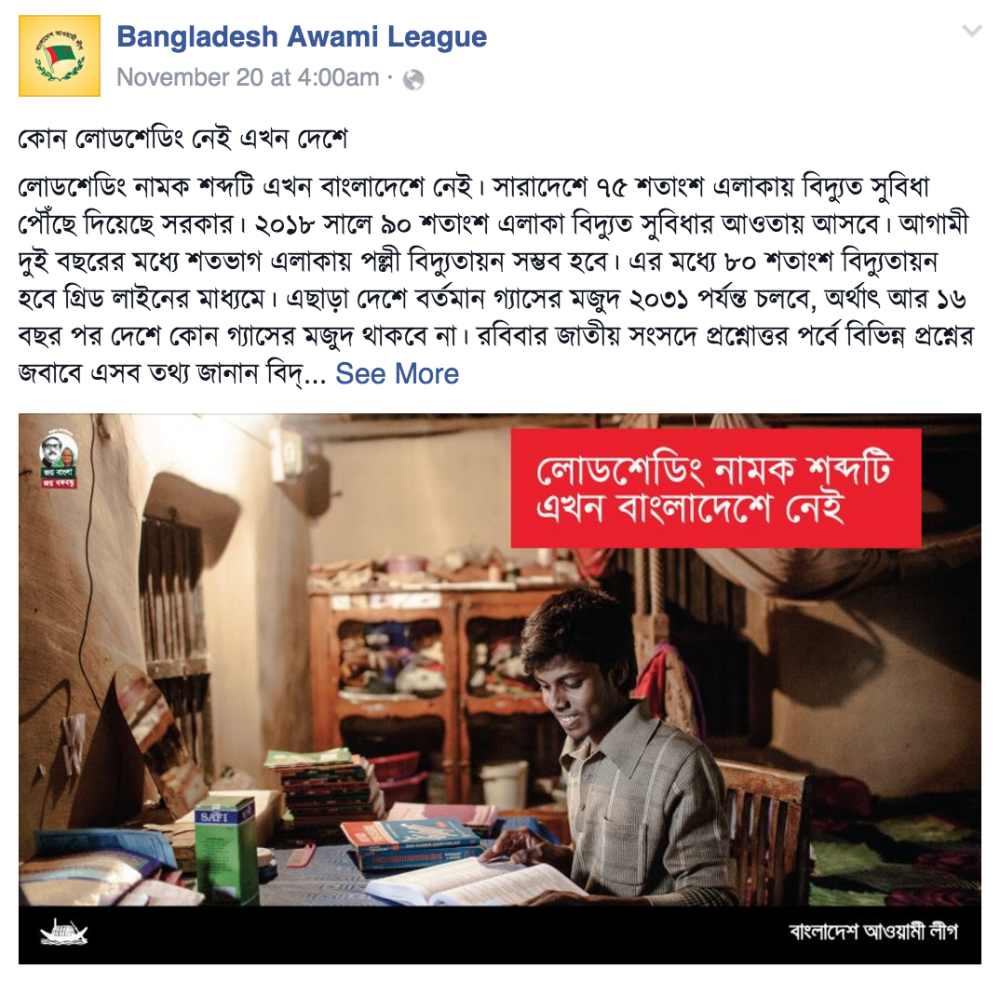

El 18 de noviembre, el gobierno bangladesí emitió una [prohibición de aplicaciones de mensajería social hasta](http://www.thedailystar.net/country/govt-orders-blocking-facebook-whatsapp-viber-174289) nuevo aviso — los proveedores de servicio bloquearon [WhatsApp, Facebook, Messenger](http://en.prothom-alo.com/bangladesh/news/86459/%E2%80%98Blocking-apps-can%E2%80%99t-be-a-solution%E2%80%99), Line, Tango y Google Hangouts. La decisión de bloquear los sitios sobrevino inmediatamente después que la Corte Suprema [ratificara las condenas a pena de muerte](http://www.dhakatribune.com/bangladesh/2015/nov/18/sc-upholds-mujahids-death-penalty) contra dos ex líderes de la oposición por su rol en la [Guerra de Liberación de 1971](https://es.wikipedia.org/wiki/Guerra_de_Liberaci%C3%B3n_de_Banglad%C3%A9s). Citando "[razones de seguridad](http://www.dhakatribune.com/bangladesh/2015/nov/19/social-networking-platforms-blocked)", el gobierno parece estar restringiendo las comunicaciones en un intento de amortiguar las protestas potenciales en respuesta a la sentencia y ejecución subsecuente de los dos hombres. Entretanto, la prohibición ha llevado a algunos desarrollos interesantes en el uso de medios sociales y herramientas de comunicaciones seguras en Bangladesh.

En el día que la prohibición de la mensajería social fue impuesta, lo que el Ministro de Estado para Correos y Telecomunicaciones, [Tarana Halim](https://en.wikipedia.org/wiki/Tarana_Halim), describió como un "[malentendido](http://www.thedailystar.net/country/internet-blocked-across-country-temporarily-174304)" llevó a que el internet fuera bloqueado totalmente en Bangladesh por aproximadamente 90 minutos, convirtiéndose así en la primera vez que el internet fue bloqueado en el país. Parece que las directivas de bloquear todas las aplicaciones de mensajería social se confundieron con bloquear el internet en sí.

Los molestos usuarios reaccionaron:

<blockquote class="twitter-tweet" lang="es">
Some ISPs stop serving https in Bangladesh to block facebook. Result is obvious! <a href="https://twitter.com/hashtag/Stupid101?src=hash">#Stupid101</a>
— Munir Hasan (@AAMunirHasan) <a href="https://twitter.com/AAMunirHasan/status/667213244403060737">noviembre 19, 2015</a></blockquote>

> Algunos ISP dejaron de dar servicio https en Bangladesh para bloquear facebook. ¡El resultado es obvio!

<blockquote class="twitter-tweet" lang="es">
Did the Govt of <a href="https://twitter.com/hashtag/Bangladesh?src=hash">#Bangladesh</a> / BTRC block Instagram too? I'm trying not to laugh. Such Digital Bangladesh... much censorship.
— Sidrat J (@SidratJ) <a href="https://twitter.com/SidratJ/status/667046230875242496">noviembre 18, 2015</a></blockquote>

> ¿El gobierno de Bangladesh / BTRC bloqueó a Instagram también? Trato de no reír. Qué tal Bangladesh digital…. mucha censura.

<blockquote class="twitter-tweet" lang="es">
Blocking <a href="https://twitter.com/hashtag/SocialMedia?src=hash">#SocialMedia</a> during unrest is rather dangerous. There’s no good reason for <a href="https://twitter.com/hashtag/Bangladesh?src=hash">#Bangladesh</a> to block them in the name of ‘security’
— Mohammad Tauheed (@mttwit) <a href="https://twitter.com/mttwit/status/668838352204996609">noviembre 23, 2015</a></blockquote>

> Bloquear los medios sociales en medio de disturbios es bastante peligroso. No hay ninguna buena razón para que Bangladesh los bloquee en el nombre de la ‘seguridad’

Una semana antes, el gobierno había dado algunas advertencias de que estaba preparado para llegar al nivel de bloquear algunas páginas web, cuando el Primer Ministro Sheikh Hasina anunció que los populares servicios de mensajería y llamadas en línea [WhatsApp y Viber serían bloqueados temporalmente](http://www.thedailystar.net/country/whatsapp-viber-be-blocked-pm-170767) “si fuese necesario, para capturar a militantes y prevenir actividades terroristas en el país”, de acuerdo a Dhaka Tribune.

¿Pero qué ha pasado mientras estos sitios han sido bloqueados?

Más bangladesíes están usando el navegador Tor o aplicaciones cifradas de mensajería como Signal. Tutoriales en idioma bengalí para estas herramientas han estado circulando fuertemente en Twitter.

<blockquote class="twitter-tweet" lang="es">
How to use Facebook in Bangladesh with Vpn <a href="https://t.co/vIOKtAnpHQ">https://t.co/vIOKtAnpHQ</a> via <a href="https://twitter.com/YouTube">@YouTube</a>
— mr.tanver (@mr_tanver) <a href="https://twitter.com/mr_tanver/status/668545766416252928">noviembre 22, 2015</a></blockquote>

> Cómo usar Facebook en Bangladesh con Vpn

Algunos improbables defensores de los servicios de mensajería seguros han surgido también, incluyendo a [bdnews24](http://bdnews24.com/), el cual recomendó el navegador seguro y anónimo Tor, a sus 110,000 seguidores:

<blockquote class="twitter-tweet" lang="es">
To avoid <a href="https://twitter.com/hashtag/Bangladesh?src=hash">#Bangladesh</a> government ban on social-media tools like <a href="https://twitter.com/hashtag/Facebook?src=hash">#Facebook</a> download Tor: <a href="https://t.co/TmEbNGHBeQ">https://t.co/TmEbNGHBeQ</a> <a href="https://t.co/ChTx6iXuMk">pic.twitter.com/ChTx6iXuMk</a>
— BD News 24 (@bdnews24) <a href="https://twitter.com/bdnews24/status/666961407942991872">noviembre 18, 2015</a></blockquote>

Parece que las personas los escucharon, también. Según la página web de estadísticas de Tor, el número de usuarios en Bangladesh se ha incrementado fuertemente desde el bloqueo, desde aproximadamente 2000 a 12000 usuarios en sólo unos cuantos días:

Hasta el partido gobernante parece estar usando tecnologías alternativas para mantener su presencia en línea. A pesar de ser los que impusieron la prohibición, la [página oficial](https://www.facebook.com/awamileague.1949/photos/a.175016089354924.1073741828.166064673583399/427855844070946/?type=3) del partido en el poder, Liga Awami, ha sido actualizada regularmente:

La Ministra Tarana Halim instó a los usuarios a sobrellevar el sufrimiento temporal por el bien del país, razonando que la medida aseguraría la seguridad a largo plazo. Ella también defendió su elección, diciendo:

Cita Original:

> The government has blocked Facebook and online messaging services WhatsApp and Viber until further notice on security grounds. The state authorities have been monitoring the people who are using those in alternative way.

Traducción:

> El gobierno ha bloqueado Facebook y los servicios de mensajería en línea WhatsApp y Viber hasta nuevo aviso por razones de seguridad. Las autoridades estatales han estado vigilando a las personas que usan estas herramientas de manera alternativa.

Un tanto increíblemente, hasta el Ministro de TIC, [Zunaid Ahmed Palak](https://en.wikipedia.org/wiki/Zunaid_Ahmed_Palak), actualizó su página web durante el bloqueo con [esta publicación](https://www.facebook.com/photo.php?fbid=10205407767696422&set=a.2187280124318.103277.1316503724&type=3) sobre Bangladesh Digital.

Cita original:

> ডিজিটাল বাংলাদেশ গড়ার লক্ষ্যে তথ্য যোগাযোগ প্রযুক্তির মাধ্যমে মহিলাদের ক্ষমতায়ন প্রকল্প "তথ্য আপা" শীর্ষক আলোচনা সভায়। হেল্প লাইন 10922.

Traducción:

> Debate sobre “Tathya Apa” – un proyecto para el empoderamiento de las mujeres mediante las TIC para construir Bangladesh Digital. Línea de ayuda 10922.

Entonces, no está claro si el gobierno ha bloqueado el portal de Facebook o prohibido el uso de Facebook totalmente.

En esta encuesta de Twitter, los usuarios dieron su opinión:

<blockquote class="twitter-tweet" lang="es">
Is the <a href="https://twitter.com/hashtag/Bangladesh?src=hash">#Bangladesh</a> ban on <a href="https://twitter.com/hashtag/Facebook?src=hash">#Facebook</a> and other social-media tools effecting your social &amp; business life?
— BD News 24 (@bdnews24) <a href="https://twitter.com/bdnews24/status/668173294126919680">noviembre 21, 2015</a></blockquote>

> ¿La prohibición de Bangladesh de Facebook y otras herramientas de medios sociales está afectando su vida social y empresarial?

Aún así, la prohibición parece estar en vigor todavía. Veremos cuánto dura. El gobierno [ya está alegando](http://www.thedailystar.net/country/no-untoward-incident-took-place-due-curbs-social-media-tarana-176842) que no se produjo ningún incidente indeseable debido a restricciones en los medios sociales. Sin embargo, si la prohibición continúa, obstaculizará el crecimiento económico en el país, [dijeron los críticos](http://www.thedailystar.net/business/social-media-ban-hinder-growth-3g-market-177046).

Si hay algún aspecto positivo que podemos sacar de este flagrante abuso de poder, quizás es que más personas comenzarán a usar tecnologías cifradas y seguras para comunicarse — aquellas que son más difíciles de doblegar para el gobierno.

[Con las aplicaciones de mensajería aún prohibidas, los bangladesíes recurrieron a Tor (y Twitter)](https://es.globalvoices.org/2015/12/12/con-las-aplicaciones-de-mensajeria-aun-prohibidas-los-bangladesies-recurren-a-tor-y-twitter/)/\[Escrito por Zara Rahman, traducido por Vanessa Peirano - Global Voices\]

Licencia: [Atribución 3.0 Unported (CC BY 3.0)](https://creativecommons.org/licenses/by/3.0/deed.es)
