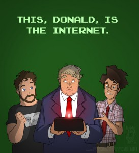

El polémico candidato republicano a la presidencia de los Estados Unidos, Donald Trump, ahora ha arremetido contra el uso de Internet, pues considera que este un medio de riesgo para jóvenes ya que es una herramienta que se ha utilizado para reclutar nuevos integrantes de ISIS, además de fomentar las prácticas radicales terroristas.

La solución que Trump propone es desconcertante, puesto que cree conveniente hablar con Bill Gates, fundador de Microsoft [viagra otc](http://www.sildenafilfromindia.net/effective-otc-treatments-for-erectile-dysfunction/), y “otras diferentes personas que sepan realmente lo que está pasando” para **cerrar Internet** y así detener al Estado Islámico.

Como es habitual, Donal Trump no deja de lado sus polémicas declaraciones:

Original:

> Somebody will say, ‘Oh freedom of speech, freedom of speech.’ These are foolish people.

Traducción:

> Algunos dirán: ‘oh libertad de expresión, libertad de expresión’. Estas son personas estúpidas.

No nos queda muy claro si Trump entiende el funcionamiento de Internet o si esto pudiera ser una consigna más que ocupe en su campaña presidencial y que aliente la censura y vigilancia. Tampoco sabemos quienes son esas “diferentes personas que realmente saben lo que pasa” a las que el candidato se refiere.

Fuentes:  
[Donald Trump thinks he can call Bill Gates to ‘close up’ the internet](http://www.theverge.com/2015/12/7/9869308/donald-trump-close-up-the-internet-bill-gates) \[The Verge\]

[Donald Trump Wants Bill Gates To ‘Close That Internet Up’](http://www.huffingtonpost.co.uk/2015/12/11/donald-trump-wants-bill-gates-to-close-that-internet-up_n_8780686.html) \[The Huffington Post UK\]

Fuente de la imagen:  
[imgur](https://imgur.com/account/favorites/82Ou8PG)
