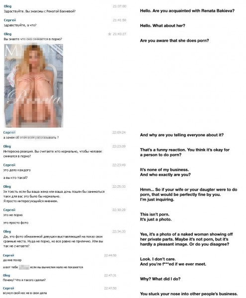

Los desarrolladores de [“FindFace“](http://findface.ru/search), que utiliza un software de reconocimiento facial para encontrar paginas de redes sociales mediante fotografías en Vkontakte (red social rusa), manifiestan que el servicio está diseñado para que sea más fácil hacer nuevos amigos. Lanzado en febrero de este año, FindFace comenzó a ganar popularidad en marzo, luego que un ingeniero de software llamado Andrei Mima [escribiera](https://vk.com/wall66559_67051) acerca del uso del servicio para localizar a dos mujeres que fotografió seis años atrás, en una calle de San Petersburgo. (Ellas le habían pedido tomarles una foto, pero nunca supo de ellas después, por lo que no fue capaz de compartirla con ellas, en ese momento).

Desde un inicio, FindFace ha generado suspicacias sobre la privacidad. (Incluso en su brillante recomendación, Mima se refirió al temor de que el servicio erosione aún más las libertades de las personas en la era de Internet). Empezando abril, un joven artista llamado Egor Tsvetkov destacó cuan invasiva puede ser la tecnología, fotografiando a los pasajeros del metro de St. Petersburgo para luego usar las fotos en la búsqueda de las páginas de estas personas en Vkontakte, utilizando FindFace. “En teoría,” Tsvetkov [dijo](https://es.globalvoices.org/2016/04/26/el-arte-ruso-del-meta-acoso/) a RuNet Echo que este servicio podría ser utilizado por un asesino en serie o un cobrador tratando de cazar a un deudor”.

Esperando alertar sobre los potenciales malos usos de FindFace, Tsvetkov parece haber inspirado a una desagradable iniciativa que es la de identificar y acosar a las mujeres rusas que aparecen en pornografía. El 9 de abril, tres días después que los medios de comunicación informaran sobre el proyecto de arte de Tsvetkov, los usuarios de una imageboard rusa llamada “Dvach” (2chan) lanzaron una campaña para sacar del anonimato a las actrices porno. Tras identificar a estas mujeres mediante FindFace, los usuarios de Dvach comparten copias archivadas de sus páginas de Vkontakte, y enviándoles spams a los correos de familiares y amigos de las mujeres informándoles sobre el descubrimiento. Esta iniciativa también estaba dirigida a las mujeres registradas en el sitio web “Intimcity”, que comercializa servicios de prostitución.

\[caption id="attachment\_333" align="alignnone" width="800"\] Los usuarios de Dvach (2chan) organizan una campaña para hostigar a mujeres rusas qe aparecen en sitios web de prostitución y pornografía.\[/caption\]

Los usuarios de Internet detrás de la campaña de hostigamiento dicen que su motivación es la indignación moral, afirmando que las mujeres en la industria del sexo son “corruptas y engañosas.” (Los usuarios de Dvach también se quejaron de que estas mujeres por lo general ignoran el tipo de hombres que componen la audiencia de Dvach).

\[caption id="attachment\_337" align="alignnone" width="495"\] Un usuario de Dvach informa sobre la foto desnuda de una mujer en una cuenta de Vkontakte.\[/caption\]

Parte de la campaña de hostigamiento incluyó una [comunidad](https://vk.com/tnn_me) creada en Vkontakte, donde se suponía que los participantes subirían enlaces a los archivos compartidos que contienen copias de páginas de medios sociales de estas mujeres. (Con este paso se pretendió proteger cualquier información que se pierda, si las mujeres eliminan sus cuentas, o se altera su configuración de privacidad). A raíz de una [denuncia](https://vk.com/wall-112659753_491) por una comunidad anti-sexista, Vkontakte prohibió rápidamente el grupo creado por los usuarios de Dvach. La página del grupo ahora muestra el siguiente mensaje:

En declaraciones a la página web TJournal, el fundador de FindFace, Maxim [Perlin, dijo](https://tjournal.ru/26824-polzovateli-dvacha-deanonimizirovali-rossiiskih-pornoaktris-s-pomoshu-findface) que no hay forma de que pueda evitar que la gente use su servicio para acosar a las mujeres de esta forma, aunque señala que distribuir pornografía ilegal en Rusia es un delito grave. “Estamos haciendo todo lo posible para proteger a todos los usuarios de Vkontakte ante posibles actos maliciosos”, dice Perlin. “Y estamos preparados, si es necesario, para proporcionar toda la información necesaria para encontrar a los usuarios responsables de este acoso”.

\_\_ [El servicio de reconocimiento facial se convierte en un arma contra las actrices porno rusas](https://es.globalvoices.org/2016/04/28/el-servicio-de-reconocimiento-facial-se-convierte-en-un-arma-contra-actrices-porno-rusas/)/\[Kevin Rothrock, traducción por Gustavo Monteverde – Advox\]

Licencia imagen de portada: CC0 Public Domain
