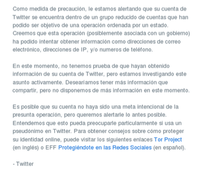

Por medio de la cuenta de Twitter de [Enjambre Digital](https://twitter.com/enjambredigital/status/676908101509980160) se dio a conocer que probablemente algún gobierno está tratando de intervenir las cuentas de usuarios mexicanos de este servicio, tal como se muestra en un tweet de [@misspartes](https://twitter.com/misspartes), quien recibió un comunicado de Twitter alertando sobre posibles intentos realizados para obtener información personal:

<iframe id="twitter-widget-0" scrolling="no" allowtransparency="true" allowfullscreen="true" class="twitter-tweet twitter-tweet-rendered" style="position: static; visibility: visible; display: block; width: 500px; height: 748.45px; padding: 0px; border: medium none; max-width: 100%; min-width: 220px; margin-top: 10px; margin-bottom: 10px;" data-tweet-id="676981530003152897" title="Tweet de Twitter" frameborder="0"></iframe>

El pasado 14 de diciembre, el diario británico The Guardian [dió a conocer](http://www.theguardian.com/technology/2015/dec/14/twitter-warns-users-hacked-state-sponsored-actors) que un grupo de usuarios de Twitter también fueron alertados, pues al igual que [@misspartes](https://twitter.com/misspartes) recibieron el mismo mensaje.

La empresa recomienda a los afectados utilizar el [navegador TOR](https://www.torproject.org/), que anonimiza la navegación.

Por su parte, Enjambre Digital ha mencionado que tomarán acciones legales contra intervenciones gubernamentales ilegales a usuarios de Twitter and [cialis from india](http://www.tadalafilfromindia.net/).

Comunicado en español:

[Twitter warns users they may have been hacked by ‘state-sponsored actors’](http://www.theguardian.com/technology/2015/dec/14/twitter-warns-users-hacked-state-sponsored-actors)/ \[Alex Hern – The Guardian\]
