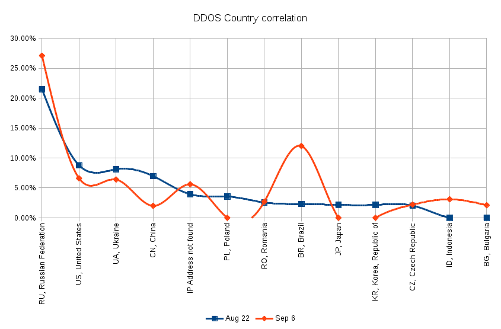

El pasado mes de marzo, Jamie McClelland, conocido ingeniero que trabaja en la operación de la infraestructura de [MayFirst People Link](https://mayfirst.org/en/index.html)[1](#fn-426:1), comenzó una charla explicando que se pueden identificar dos tipos de ataques informáticos: los enfocados a comprometer la seguridad y tomar control de la infraestructura y los dirigidos a saturarla, para que los servidores queden no disponibles para su funcionamiento. Estas categorías también pueden operar mixtamente, pero las mencionadas anteriormente son un buen punto de partida.

Entre agosto y septiembre del 2015, **MayFirst People Link recibió ataques** enfocados en saturar la infraestructura con el fin de volverla inoperable para sus usuarios, se trataba pues de una Denegación de servicio.

Esta [Denegación de Servicio Distribuida](https://es.wikipedia.org/wiki/Ataque_de_denegaci%C3%B3n_de_servicio) (DDoS por sus siglas en inglés), es considerada entre los ataques más grandes por su volumen en la historia de MayFirst; en este caso se monitorearon las velocidades de los ataques, las que oscilaron entre los 20Gbps con una duración de casi tres semanas.

El ataque comenzó contra el servidor que alojaba el sitio de la organización [The national network of abortion funds](https://fundabortionnow.org/). Por medio del envío de tráfico a través de peticiones al servidor desde computadoras comprometidas, mismas que lograron saturarlo y dejarlo no disponible para su consulta y acceso. Más tarde, las técnicas implicadas en el ataque se hicieron más complejas, lo que ocasionó que por momentos todo MayFirst quedara intermitente para sus miembros.

Para hacer frente a estos ataques sistemáticos, MayFirst realizó tareas alrededor de la investigación, técnica y el fondeo colectivo. En ese camino se encontró con el proyecto [Deflect](https://equalit.ie/portfolio/deflect/), parte de la organización eQualit.ie. Ellos desarrollan tecnología que tiene tres principios tecnológicos fundamentales: Cacheo, Banning y Monitoreo. Pero más allá de eso, Deflect se ha logrado convertir en los últimos dos años en una comunidad de aprendizaje que estudia y hace frente creativamente al negocio de los ataques que se venden al mejor postor, y que pueden ir desde los 5 dólares hasta otro tipo de servicios a mayores costos.

En ese sentido, los aprendizajes que documenta MayFirst son, en sus propias palabras:

- **Los ataques de este tipo serán más frecuentes y más graves.** Es un reflejo de la agudización de la lucha política en este país como a nivel internacional.
- En lugar de depender de lo que ya está disponible en las formas típicas, **nuestra organización tiene que llevar a nuestro movimiento en la búsqueda de formas innovadoras para combatir y derrotar a los tipos de ataques** que acabamos enfrentar, los cuales están determinados a aumentar en el futuro.
- **Las comunicaciones entre nuestros técnicos y nuestros miembros es uno de los factores más críticos en sobrevivir** a este tipo de ataques. Lo hicimos mejor en este tiempo y nuestros miembros respondieron, pero hay que mejorar la velocidad de nuestras respuestas y las comunicaciones y asegurar que lleguen a todos y cada uno de nosotros.

* * *

1. Organización sin ánimo de lucro fundada en el 2005 que se dedicada a proveer servicios cooperativos de [internet](http://svenskacasinon24.se/) como web hosting a personas y organizaciones. 
