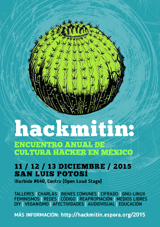

Desde aquí, una ciudad en la zona centro de la república, el viaje a San Luís dura casi 7 horas, pasaremos por Quéretaro sede del hackmitin en 2014. Mi corazón palpita fuerte, traigo una canción en el bolsillo. Sí es literal, es la grabación del **_compi Carcará_**, que con metáforas de [lo comunitario en el Software Libre](http://media.espora.org/u/anamhoo/m/del-software-libre-a-la/) escribió al reflexionar la importancia de la cultura libre.

Tengo muuuuchas preguntas, quién llegará este año, el trayecto es largo y el bolsillo anda medio vacío, las compis con las que estamos dialogando el **transhackfeminismo** no vendrán, llegar de San Cristóbal de Las Casas, Oaxaca o hasta el DF, resulta bien difícil y ellas han tenido que optar por conservar los recursos para otros momentos, pero traigo sus voces en la mochila. Sí, es literal, llevo la lotería **transhackfeminista**, juego que iniciamos y que en lo lúdico ha resultado una forma valiosa de conversación.

Ha sido un año intenso, vivimos como lugares comunes el [femhack](https://f3mhack.org/index.php/es/), el [transhack](http://sursiendo.com/blog/2015/06/segundo-encuentro-transhackfeminista-mexico-thfmx2015/), el [Primer Seminario: Tecnologías libres y cooperativas -copyleft- en el movimiento social de izquierda](http://sl-izq.net/2015), además de charlas, talleres y noches de **cerveza y hacking**.

Llego bien temprano, seis de la mañana, necesito un café y la red, no apunté la dirección, me asomo a una cafetería y veo una computadora que luce dos pegatinas: una de la Free Software Fundation y otra de Mozilla, él viene al [hackmitin](http://hackmitin.espora.org/2015/), no dudo en hablarle y sentarme con él. En unos minutos ya me está contando sobre un programa estadístico cuyas bases científicas y de construcción colectiva son impresionantes. “R”, tiene preparado un nodo \[espacio tiempo en el que compartimos palabras, saberes, charla taller o laboratorio, el formato es el que se antoje\].

Alimentado de **culturas transfronterizas**, virtualizado por momentos, pero nada irreal, el hackmitin es un encuentro en el que la diferencia se celebra, suele ser menos técnico y más tecnopolítico, se hizo por primera vez en DF en 2009[1](#fn-221:*) gracias al esfuerzo de muchos compañeros y unas cuantas compañeras que habitaban ya ciudad monstruo y que después vimos cargando enormes maletas de un lado a otro para ayudar a poner redes, dar talleres o hacer instalaciones, la sede fue un espacio liberado temporalmente, la ZAM (**Zona Autónoma Makhnovtchina**).

En la convocatoria se leía:

> El Hackmitin es un encuentro libre y autogestionado que gira en torno a las nuevas tecnologías, sus implicaciones sociales, la libre circulación de saberes y técnicas, la privacidad, la creación colectiva, el conflicto telemático… Está destinado a todo tipo de personas que tengan una mente abierta y curiosa con ganas de compartir sus experiencias y vivirlo participando en la coordinación como una más. Algunas charlas y talleres exigen conocimientos informáticos avanzados, otros no; y otros, ni informáticos.

Quienes redactaron el llamado supieron plasmar cosas esenciales de **la cultura hacker** con todo el caos que pueda implicar para quienes en libertad decidimos hacer juntxs.

Siete años después el hackmitin sigue construyendo historia. En el tiempo nos hemos preocupado juntxs por un México en el que lo ‘gore’ abunda, la industria extractiva esta transformando el espacio adoptando legislaciones, comprando políticos o desapareciendo lo que haga falta para que el tren del ‘desarrollo’ siga tocando su música de metales friccionados; y juntxs nos preguntamos cuál es el papel de la tecnología, cómo nos defendemos de la vigilancia, qué herramientas tenemos para la resistencia y más aún, cómo hacemos futuro.

Aquí lo mismo se habla de servidores que del costo para Latinoamérica de la extracción de minerales. En estos años han participado hermanxs del norte y del sur, hay quien cruzó el océano y pensaba quedarse una semana y se quedó por años, todxs somos parte de esta historia.

Por mis desviaciones mentales :$ uno de los nodos que más disfruté éste año fue el de Inteligencia artificial, lejos de robots humanizados, sólo con una consola y **python anaconda** vimos cómo una máquina aprende.

Lxs compis de San Luis se rifaron en el trabajo para hacer posible un año más de sueños, tuvimos poco tiempo para conocer del trabajo que realizan, pero entre ellxs lo autónomo y la cultura punk, se transpiraba. Con todo, el hackmitin de este año tuvo poca asistencia, tal vez unas 25 personas de forma constante, muchos nodos no se dieron, no hubo noche de hacking y el horario de actividad se redujo notablemente.

Vivimos en una cultura que desde pequeños nos dice “todos somos prescindibles, incluso reemplazables”, y si, en parte, lo que se hace debe continuarse, no podemos depender de una persona en particular para **seguir en la acción colectiva**, pero al mismo tiempo cada persona ocupó un espacio, nutrió y llenó de energía el hackmitin, no somos reemplazables, y este año tuvimos que reconocer las ausencias. No tuvimos redes abiertas, faltó equipo, faltaron preguntas y saberes. Tal vez es un período de transición, un momento para decidir ser parte y tomar compromiso por la actividad, un buen momento para reconocer trayectorias, para no dejarnos ganar por la inercia y seguir decidiendo.

Abrazo solidario y cariños para todos los y las hackers y hacktivistas que nadando no contracorriente sino haciendo remolinos y trayectorias caóticas disfrutamos un año más.

[@Sursiendo](https://twitter.com/sursiendo)

* * *

2. Una nota recuperando la experiencia se puede ver en [http://sursiendo.com/blog/2014/05/breve-historia-del-hackmitin-en-mexico/](http://sursiendo.com/blog/2014/05/breve-historia-del-hackmitin-en-mexico/) [↩](#fnref-221:*)
