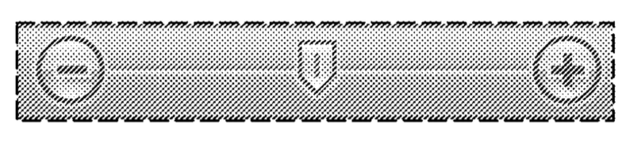

La [Electronic Frontier Foundation](https://www.eff.org/) dedica la [**“patente estúpida del mes”** a Microsoft](https://www.eff.org/deeplinks/2015/12/stupid-patent-month-microsofts-design-patent-slider). Esto sucede tras la reciente demanda de Microsoft contra Corel, en la que alega poseer el diseño de los controles deslizables. La denuncia fue interpuesta el pasado 18 de diciembre, y lleva el nombre de “interfaz de usuario para una parte de la pantalla”

Vera Ranieri, abogada de la organización EFF, termina en su reporte al agregar que:

> Eso suena muy loco para nosotros. Pero eso es exactamente lo que podría suceder si Microsoft prevalece contra Corel. Dejando de lado si el diseño de Microsoft era en realidad nueva y no evidente en 2006 (cuando Microsoft presentó su solicitud), si Microsoft necesitaba el incentivo de patentar es con el fin de llegar a este diseño, y si fuera incluso deseable conceder a una empresa un respaldo por el gobierno para el monopolio de un deslizador gráfico (que no lo creemos, por eso esta es una patente estupida), el alcance de daños y perjuicios por infracción de patentes de diseño tiene el potencial para convertirse en una poderosa herramienta que cierre la competencia legítima basada en la mera amenaza de un demanda judicial.

[Original](http://www.sildalisonline.com/):

> That sounds pretty crazy to us. But that’s exactly what might happen if Microsoft prevails against Corel. Putting aside whether Microsoft’s design was actually new and not obvious in 2006 (when Microsoft filed its application), whether Microsoft needed the patent incentive in order to come up with this design, and whether it is even desirable to grant a company a government-backed monopoly on a graphical slider (we don’t think so, that’s why this is a stupid patent), the scope of damages for design patent infringement has the potential to become a powerful tool to shut down legitimate competition based on the mere threat of a lawsuit.

El diseño en pugna es:

Veremos cuál es el resultado de esta demanda, pues como bien lo señala Vera Ranieri, las demandas pueden devenir en una situación desfavorable para la competencia.

[Stupid Patent of the Month: Microsoft’s Design Patent on a Slider](https://www.eff.org/deeplinks/2015/12/stupid-patent-month-microsofts-design-patent-slider)

[Microsoft v Corel – Denuncia](https://www.eff.org/files/2015/12/28/microsoft_v_corel_-_complaint.pdf)
